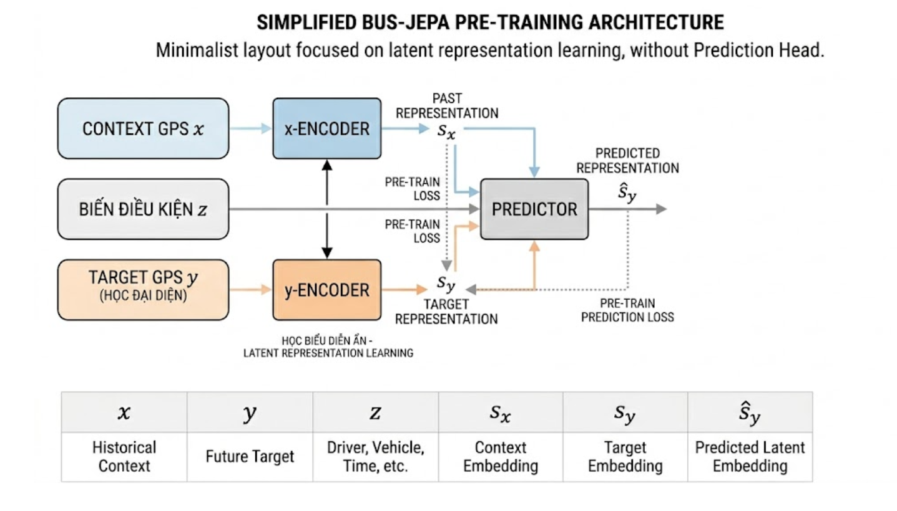

# Bus-JEPA: Mô hình Học Đại Diện Chuyển Động Xe Buýt

Tài liệu này trình bày về mô hình **Bus-JEPA** (Joint-Embedding Predictive Architecture) được áp dụng để học các đặc trưng chuyển động (kinematic representations) của xe buýt một cách tự giám sát (self-supervised).

---

## 1. Kiến trúc Tổng quan (Conceptual Architecture)

Bus-JEPA dựa trên kiến trúc **I-JEPA** (Image-JEPA) của Meta AI, nhưng được tùy chỉnh cho dữ liệu chuỗi thời gian GPS. Thay vì dự đoán các pixel bị che (mask), mô hình dự đoán **không gian ẩn (latent space)** của vị trí tiếp theo dựa trên bối cảnh lịch sử.

*Lưu ý: Sơ đồ trên mô tả luồng học đại diện từ Context GPS sang Target GPS thông qua các bộ mã hóa (Encoders).*

---

## 2. Xử lý Dữ liệu (Data Processing Pipeline)

Để huấn luyện Bus-JEPA, dữ liệu đi qua hai giai đoạn xử lý chính tại tầng **Gold**:

### 2.1 Kỹ thuật Đặc trưng Vật lý (Physics Delta Engineering)
Dữ liệu GPS thô sau khi được lọc bởi Kalman Filter sẽ được tính toán các biến động vật lý:
- **Deltas**: `delta_x`, `delta_y`, `delta_heading`.
- **Kinematics**: `speed` (vận tốc), `acceleration` (gia tốc).
- **Time Encoding**: Giờ trong ngày được mã hóa bằng hàm Sin/Cos (`Time_Sin`, `Time_Cos`) để mô hình hiểu được tính chu kỳ của thời gian.

*Triển khai tại: [gold_jepa_features.py](../pipelines/gold/gold_jepa_features.py)*

### 2.2 Tạo Chuỗi Cửa sổ Trượt (Sequence Windowing)
Mô hình không nhìn vào từng điểm riêng lẻ mà nhìn vào một chuỗi các pings:
- **SEQ_LENGTH = 10**: Mỗi mẫu huấn luyện bao gồm 10 pings liên tiếp.
- **Dịch cửa sổ**: `obs_t` (pings 0-9) và `obs_next` (pings 1-10).
- **Lọc Gap**: Loại bỏ các chuỗi có khoảng cách thời gian quá lớn (> 5 phút) để đảm bảo tính liên tục của hành vi lái xe.

*Triển khai tại: [gold_jepa_sequences.py](../pipelines/gold/gold_jepa_sequences.py)*

---

## 3. Thành phần Mô hình (Model Components)

Mô hình bao gồm ba mạng thần kinh chính:

1. **Context Encoder ($x$-Encoder)**: 
   - Đầu vào: Chuỗi 10 pings lịch sử ($x$) + `route_id`.
   - Đầu ra: Vectơ không gian ẩn đại diện cho bối cảnh lái xe ($s_x$).
   - Kiến trúc: 1D CNN với các khối Residual.

2. **Target Encoder ($y$-Encoder)**:
   - Đầu vào: Chuỗi pings mục tiêu ($y$ - thường là chuỗi $x$ dịch đi 1 bước).
   - Đầu ra: Vectơ không gian ẩn mục tiêu ($s_y$).
   - **Đặc điểm**: Là một bản sao của Context Encoder nhưng được cập nhật bằng trọng số trung bình trượt (**EMA - Exponential Moving Average**), không lan truyền ngược (no gradient).

3. **Predictor**:
   - Đầu vào: $s_x$ + Hành động/Thời gian (`delta_time`).
   - Nhiệm vụ: Dự đoán vectơ $s_y$ từ $s_x$.
   - Mục tiêu: Dự đoán $\hat{s}_y$ sao cho gần với $s_y$ nhất.

---

## 4. Cơ chế Huấn luyện (Self-Supervised Learning)

Bus-JEPA không cần nhãn (label) con người tạo ra. Nó tự học bằng cách:
- **Loss Function**: Sử dụng `Smooth L1 Loss` giữa vectơ dự đoán ($\hat{s}_y$) và vectơ mục tiêu thực tế ($s_y$).
- **Tránh sụp đổ mô hình (Collapse Prevention)**: Việc sử dụng Target Encoder với cơ chế EMA giúp mô hình không rơi vào trạng thái hội tụ về một vectơ hằng số (tất cả đầu ra bằng 0).
- **Mục tiêu cuối cùng**: Sau khi huấn luyện, bộ mã hóa (Encoder) sẽ có khả năng trích xuất "ngôn ngữ chuyển động" của xe buýt, giúp ích cho các bài toán hạ nguồn như phát hiện bất thường, dự báo thời gian đến bến (ETA), hoặc nhận diện hành vi lái xe nguy hiểm.

---

## 5. Tham khảo mã nguồn

- **Notebook huấn luyện**: [data_processing_for_jepa.ipynb](../notebooks/data_processing_for_jepa.ipynb)
- **Pipeline đặc trưng**: [gold_jepa_features.py](../pipelines/gold/gold_jepa_features.py)
- **Pipeline tạo chuỗi**: [gold_jepa_sequences.py](../pipelines/gold/gold_jepa_sequences.py)
