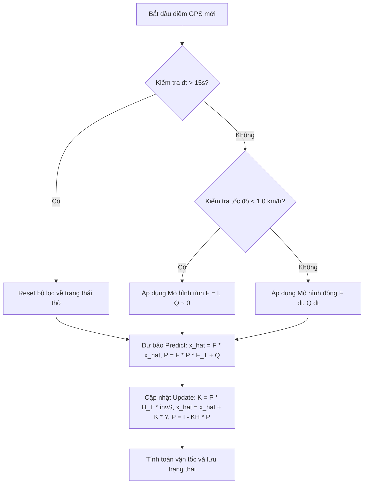

# Tài liệu Thuật toán Kalman Filter 2D Động (Dual-Model Kalman Filter)

Tài liệu này trình bày chi tiết về mô hình toán học và logic thuật toán của bộ lọc Kalman (Kalman Filter) hiện tại được áp dụng ở tầng Silver để xử lý làm mịn dữ liệu tọa độ GPS xe buýt.

---

## 1. Mô hình Trạng thái Chuyển động (Constant Velocity Model)

Bộ lọc Kalman sử dụng mô hình **Vận tốc không đổi (Constant Velocity - CV)** trong không gian 2 chiều (Kinh độ/Vĩ độ) để dự đoán vị trí tiếp theo của xe buýt.

### 1.1 Vectơ Trạng thái (State Vector)
Vectơ trạng thái $\mathbf{x}_k$ tại thời điểm $k$ biểu diễn vị trí và vận tốc của xe:
$$\mathbf{x}_k = \begin{bmatrix} x_k \\ y_k \\ v_{x,k} \\ v_{y,k} \end{bmatrix}$$
Trong đó:
* $x_k, y_k$: Tọa độ địa lý của xe (Kinh độ, Vĩ độ).
* $v_{x,k}, v_{y,k}$: Vận tốc thay đổi tọa độ theo trục Kinh độ và Vĩ độ (độ/giây).

### 1.2 Ma trận Chuyển đổi Trạng thái ($F$)
Ma trận $F$ mô tả sự biến đổi trạng thái vật lý từ thời điểm $k-1$ sang $k$ sau khoảng thời gian $\Delta t$:
$$F = \begin{bmatrix} 1 & 0 & \Delta t & 0 \\ 0 & 1 & 0 & \Delta t \\ 0 & 0 & 1 & 0 \\ 0 & 0 & 0 & 1 \end{bmatrix}$$
Khi nhân với vectơ trạng thái trước đó, ta có mô hình dự đoán vị trí:
$$x_k = x_{k-1} + v_{x,k-1} \Delta t$$
$$y_k = y_{k-1} + v_{y,k-1} \Delta t$$

---

## 2. Mô hình Đo lường (Measurement Model)

Thiết bị GPS thô chỉ cung cấp vị trí $(x, y)$ mà không cung cấp chính xác thành phần vận tốc $v_x, v_y$ theo tọa độ. 

### 2.1 Vectơ Đo lường ($z_k$)
$$\mathbf{z}_k = \begin{bmatrix} z_{x,k} \\ z_{y,k} \end{bmatrix}$$

### 2.2 Ma trận Đo lường ($H$)
Ma trận $H$ ánh xạ từ vectơ trạng thái 4 chiều sang không gian đo lường 2 chiều:
$$H = \begin{bmatrix} 1 & 0 & 0 & 0 \\ 0 & 1 & 0 & 0 \end{bmatrix}$$

---

## 3. Quản lý Sai số và Nhiễu (Noise Covariance)

### 3.1 Nhiễu Đo lường ($R$)
Ma trận hiệp phương sai nhiễu đo lường $R$ đại diện cho sai số ngẫu nhiên của máy thu GPS:
$$R = \begin{bmatrix} R_{var} & 0 \\ 0 & R_{var} \end{bmatrix}$$
Hiện tại, hệ thống sử dụng tham số tối ưu hóa $R_{var} = 5 \times 10^{-8}$ (tương đương sai số tiêu chuẩn khoảng $\approx 25\text{m}$ về khoảng cách địa lý).

### 3.2 Nhiễu Hệ thống ($Q$)
Ma trận $Q$ mô tả sai số của mô hình vật lý (xe tăng/giảm tốc hoặc rẽ, không đi thẳng đều). Áp dụng mô hình **Gia tốc nhiễu trắng liên tục (Continuous White Noise Acceleration)**:
$$Q = \sigma_a^2 \begin{bmatrix} \frac{\Delta t^4}{4} & 0 & \frac{\Delta t^3}{2} & 0 \\ 0 & \frac{\Delta t^4}{4} & 0 & \frac{\Delta t^3}{2} \\ \frac{\Delta t^3}{2} & 0 & \Delta t^2 & 0 \\ 0 & \frac{\Delta t^3}{2} & 0 & \Delta t^2 \end{bmatrix}$$
Trong đó, tham số gia tốc nhiễu hệ thống được cấu hình $\sigma_a^2 = 1.96 \times 10^{-10}$ (tương ứng với gia tốc xe buýt thông thường khoảng $1.55\text{ m/s}^2$).

---

## 4. Mô hình Động Kép (Dual-Model Kalman Filter)

Để giải quyết triệt để lỗi **GPS drift (trôi tọa độ tĩnh)** khi xe dừng đỗ tại các bến xe hoặc dừng đèn đỏ, thuật toán tích hợp logic kiểm tra trạng thái đứng yên của xe:

### 4.1 Điều kiện dừng tĩnh (Stationary Check)
Nếu tốc độ đo được từ cảm biến cơ học của xe nhỏ hơn $1.0\text{ km/h}$:
$$\text{is\_stationary} = (\text{speed}_{raw} < 1.0\text{ km/h})$$

### 4.2 Cấu hình Mô hình tĩnh (Stationary Model)
Khi xe ở trạng thái tĩnh, thuật toán ép các thành phần vận tốc và hiệp phương sai vận tốc về 0, đồng thời chuyển đổi ma trận $F$ và $Q$ sang trạng thái đứng yên tuyệt đối:
* **Áp cứng vận tốc**: $v_x = 0, v_y = 0$ và triệt tiêu phương sai vận tốc trong ma trận $P$.
* **Ma trận chuyển đổi tĩnh**: $F = I_4$ (mô hình vị trí không đổi, độc lập với $\Delta t$).
* **Nhiễu hệ thống tĩnh**: Gán ma trận $Q$ về giá trị cực nhỏ ($10^{-12}$ ở đường chéo tọa độ và $0$ ở vận tốc). Điều này ngăn chặn hoàn toàn việc cập nhật các dịch chuyển nhiễu ngẫu nhiên của GPS vào trạng thái tối ưu, khóa chặt tọa độ xe tại chỗ dừng đỗ.

---

## 5. Chu trình Lọc Kalman (Predict & Update Loop)

Với mỗi điểm GPS của phương tiện theo thời gian, chu trình toán học thực hiện tuần tự:

### 5.1 Bước Dự báo (Predict Step)
Dự báo trạng thái và sai số hiệp phương sai cho thời điểm hiện tại:
1. Trạng thái dự báo trước: 
   $$\hat{\mathbf{x}}_k^- = F \hat{\mathbf{x}}_{k-1}$$
2. Hiệp phương sai dự báo trước: 
   $$P_k^- = F P_{k-1} F^T + Q$$

### 5.2 Bước Hiệu chỉnh (Update Step)
Kết hợp dữ liệu thô mới để tối ưu hóa vị trí:
1. Sai số dự báo (Innovation): 
   $$\mathbf{y}_k = \mathbf{z}_k - H \hat{\mathbf{x}}_k^-$$
2. Hiệp phương sai phần dư: 
   $$S_k = H P_k^- H^T + R$$
3. Hệ số độ lợi Kalman (Kalman Gain): 
   $$K_k = P_k^- H^T S_k^{-1}$$
4. Cập nhật trạng thái tối ưu: 
   $$\hat{\mathbf{x}}_k = \hat{\mathbf{x}}_k^- + K_k \mathbf{y}_k$$
5. Cập nhật hiệp phương sai tối ưu: 
   $$P_k = (I - K_k H) P_k^-$$

---

## 6. Cơ chế Tự động Thiết lập lại (Auto-Reset)

Nếu khoảng thời gian $\Delta t$ giữa 2 điểm liên tiếp lớn hơn $15.0\text{ giây}$ (do mất tín hiệu GPS đi qua đường hầm, hẻm núi đô thị hoặc xe tắt máy đỗ qua đêm), bộ lọc sẽ tự động kích hoạt chế độ **Reset**:
- Thiết lập lại trạng thái vị trí $\hat{\mathbf{x}}$ bằng tọa độ GPS thô mới nhận được.
- Đặt vận tốc ban đầu về 0.
- Khôi phục ma trận hiệp phương sai sai số $P$ về giá trị mặc định của điểm khởi tạo ban đầu.
Cơ chế này ngăn việc áp dụng ma trận chuyển đổi $F$ với $\Delta t$ quá lớn, gây ra các dự đoán ngoại suy (extrapolation) sai lệch nghiêm trọng.
