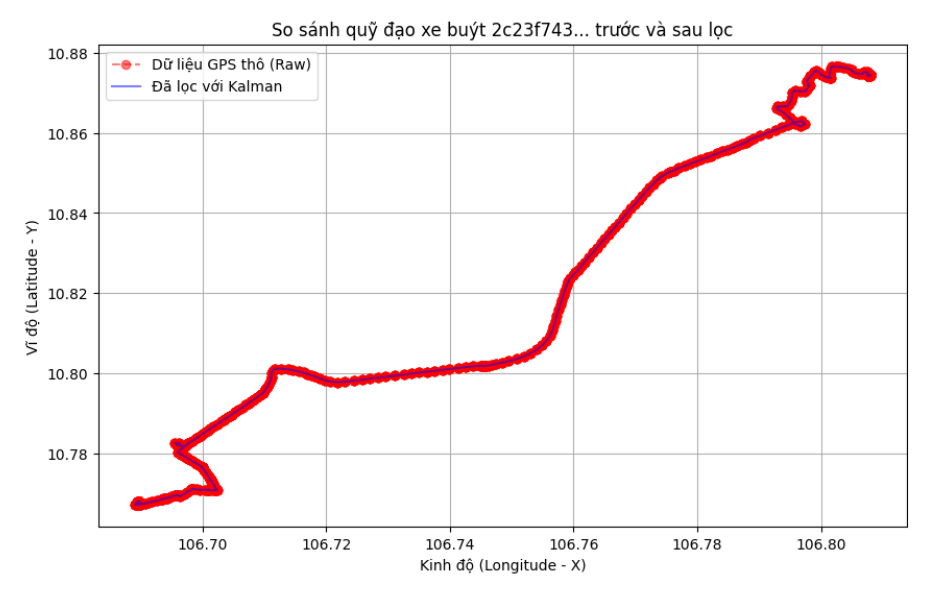

# Lọc Nhiễu GPS Bằng Giải Thuật Kalman Filter (Bus GPS Smoothing)

Tài liệu này chi tiết hóa việc áp dụng giải thuật **Kalman Filter** để xử lý loại bỏ nhiễu (denoising) dữ liệu tọa độ GPS thu thập từ thiết bị giám sát hành trình trên xe buýt.

---

## 1. Tại sao cần Kalman Filter?

Dữ liệu GPS thô (Raw) thường gặp các vấn đề:
- **Nhiễu ngẫu nhiên**: Sai số vài mét đến hàng chục mét do điều kiện thời tiết, vật cản (nhà cao tầng, cây cối).
- **Nhảy tọa độ (GPS Jumps)**: Tọa độ bị lệch xa vị trí thực tế trong thời gian ngắn.
- **Tần suất gửi tin không đều**: Khoảng cách thời gian giữa các gói tin (pings) không cố định.

Kalman Filter giúp ước lượng trạng thái thực của xe bằng cách kết hợp **mô hình vật lý** (dự đoán vị trí dựa trên vận tốc) và **dữ liệu đo lường** thực tế.

---

## 2. Mô hình Toán học (Constant Velocity Model)

Chúng ta sử dụng mô hình vận tốc không đổi (**Constant Velocity - CV**) để mô tả chuyển động của xe buýt trong không gian 2D (Kinh độ/Vĩ độ hoặc X/Y).

### 2.1 Vectơ Trạng thái (State Vector)
Vectơ trạng thái $\mathbf{x}$ bao gồm vị trí và vận tốc tại thời điểm $k$:
$$\mathbf{x}_k = [x, y, v_x, v_y]^T$$
Trong đó:
- $x, y$: Tọa độ (vị trí).
- $v_x, v_y$: Vận tốc theo phương x và y.

### 2.2 Ma trận Chuyển đổi Trạng thái (State Transition Matrix - $F$)
Giả sử giữa hai lần đo lường có khoảng thời gian $\Delta t$ (dt):
$$F = \begin{bmatrix} 1 & 0 & \Delta t & 0 \\ 0 & 1 & 0 & \Delta t \\ 0 & 0 & 1 & 0 \\ 0 & 0 & 0 & 1 \end{bmatrix}$$

### 2.3 Ma trận Đo lường (Measurement Matrix - $H$)
Vì thiết bị chỉ cung cấp tọa độ $(x, y)$, ma trận $H$ dùng để trích xuất vị trí từ vectơ trạng thái:
$$H = \begin{bmatrix} 1 & 0 & 0 & 0 \\ 0 & 1 & 0 & 0 \end{bmatrix}$$

---

## 3. Quản lý Nhiễu (Noise Management)

Đây là phần quan trọng nhất để bộ lọc hoạt động hiệu quả.

### 3.1 Nhiễu Đo lường (Measurement Noise - $R$)
Đại diện cho sai số của thiết bị GPS. 
* **Cấu hình tối ưu hiện tại:** Ma trận nhiễu đo lường được cố định ở mức ổn định $R_{var} = 1 \times 10^{-6}$ (tương ứng với độ lệch chuẩn sai số GPS thực tế trong đô thị là $\approx 111$ mét).
* **Lý do bỏ Adaptive R (Hiệu chuẩn động):** Ban đầu hệ thống tự động tính toán $R$ cho từng xe dựa trên các phân đoạn dừng đỗ (vận tốc $\le 2$ km/h). Tuy nhiên, trên thực tế nhiều xe bị **hỏng cảm biến tốc độ** (luôn báo vận tốc $\le 2$ km/h khi đang chạy), dẫn đến việc thuật toán hiệu chuẩn tính sai lệch phương sai của cả ngày chạy thành phương sai tĩnh, khiến bộ lọc Kalman bị trôi lệch nghiêm trọng (lên tới 28 mét). Việc sử dụng $R$ cố định $10^{-6}$ khắc phục triệt để lỗi này, giảm độ lệch trung bình toàn hệ thống xuống còn $8.5$ mét.

### 3.2 Nhiễu Hệ thống (Process Noise - $Q$)
Đại diện cho sự không chắc chắn của mô hình vật lý (xe không thực sự đi với vận tốc hằng số, có tăng/giảm tốc).
Sử dụng mô hình nhiễu gia tốc trắng (**White Noise Acceleration Model**):
$$Q = G \cdot G^T \cdot \sigma_a^2$$
Với $\sigma_a^2 = 1 \times 10^{-11}$ (tương đương với độ lệch chuẩn gia tốc khoảng $0.35\text{ m/s}^2$ trong thực tế, phù hợp với đặc tính chuyển động êm ái, đầm của xe buýt đô thị).
Ma trận $Q$ phụ thuộc vào $\Delta t$:
$$Q = \sigma_a^2 \begin{bmatrix} \frac{\Delta t^4}{4} & 0 & \frac{\Delta t^3}{2} & 0 \\ 0 & \frac{\Delta t^4}{4} & 0 & \frac{\Delta t^3}{2} \\ \frac{\Delta t^3}{2} & 0 & \Delta t^2 & 0 \\ 0 & \frac{\Delta t^3}{2} & 0 & \Delta t^2 \end{bmatrix}$$

---

## 4. Chu trình Thực thi (The Kalman Loop)

Với mỗi gói tin GPS mới, bộ lọc thực hiện 2 bước:

### Bước 1: Dự đoán (Predict)
Ước lượng trạng thái và độ lỗi dự đoán cho thời điểm hiện tại dựa trên trạng thái trước đó.
1. Dự đoán trạng thái: $\hat{x}_k^- = F \hat{x}_{k-1}$
2. Dự đoán hiệp phương sai lỗi: $P_k^- = F P_{k-1} F^T + Q$

### Bước 2: Cập nhật (Update)
Điều chỉnh dự đoán dựa trên dữ liệu đo lường thực tế ($z_k$).
1. Tính toán phần dư (Innovation): $y_k = z_k - H \hat{x}_k^-$
2. Tính toán độ lợi Kalman (Gain): $K_k = P_k^- H^T (H P_k^- H^T + R)^{-1}$
3. Cập nhật trạng thái tối ưu: $\hat{x}_k = \hat{x}_k^- + K_k y_k$
4. Cập nhật hiệp phương sai lỗi: $P_k = (I - K_k H) P_k^-$

---

## 5. Kết quả đạt được

- **Làm mịn quỹ đạo**: Loại bỏ các răng cưa khi xe di chuyển trên đường thẳng.
- **Xử lý mất tín hiệu**: Khi mất GPS trong thời gian ngắn, mô hình dự đoán (CV) vẫn có thể duy trì quỹ đạo ước lượng hợp lý.
- **Độ chính xác cao hơn**: Vị trí sau khi lọc gần với tim đường (centerline) hơn so với dữ liệu thô.

---

## 6. Vai trò đối với Mô hình AI (Bus-JEPA)

Việc áp dụng Kalman Filter ở tầng Silver đóng vai trò "nền móng" cho việc huấn luyện mô hình **Bus-JEPA**:

- **Ổn định Feature Engineering**: Các đặc trưng vật lý như `delta_x`, `delta_y` và `acceleration` (gia tốc) cực kỳ nhạy cảm với nhiễu tọa độ. Kalman Filter giúp các giá trị này không bị biến động cực đoan do sai số GPS ngẫu nhiên.
- **Dữ liệu huấn luyện sạch hơn**: Giúp mô hình tập trung học các đặc thù chuyển động thực tế của xe buýt thay vì học cách "bù đắp" cho nhiễu của thiết bị đo.
- **Tính nhất quán của chuỗi (Sequence Consistency)**: Vì Bus-JEPA học từ các chuỗi (sequences) 10 pings liên tiếp, sự mượt mà giữa các điểm trong chuỗi là yếu tố then chốt để mô hình Encoder trích xuất được không gian ẩn (Latent Space) chất lượng cao.

---

## 7. Tham khảo mã nguồn

Giải thuật này được triển khai và kiểm thử tại các file sau:
- **Bản Python Core (Logic Kalman)**: [pipelines/silver/kalman_filter.py](file:///d:/Projects/mp-252/pipelines/silver/kalman_filter.py) - Định nghĩa lớp `RedisBackedKalmanFilter` chứa logic toán học và lưu trữ trạng thái xe với Redis.
- **Bản Production (PySpark/Pandas UDF)**: [pipelines/silver/silver_buswaypoint.py](file:///d:/Projects/mp-252/pipelines/silver/silver_buswaypoint.py) - Áp dụng trực tiếp vào pipeline xử lý dữ liệu streaming từ Bronze lên Silver bằng Spark Structured Streaming.
- **Bản Demo (Pandas/Matplotlib)**: [scripts/kalman_filter_demo.py](file:///d:/Projects/mp-252/scripts/kalman_filter_demo.py) - Bản chạy thử nghiệm cục bộ phục vụ nghiên cứu và trực quan hóa kết quả.

---

> [!TIP]
> Để điều chỉnh độ "mượt" của bộ lọc:
> - Tăng $R$: Tin tưởng vào mô hình hơn (đường đi mượt hơn nhưng phản ứng chậm với thay đổi hướng).
> - Tăng $\sigma_a^2$ trong $Q$: Tin tưởng vào dữ liệu đo lường hơn (bám sát dữ liệu thô hơn, ít mượt hơn).

